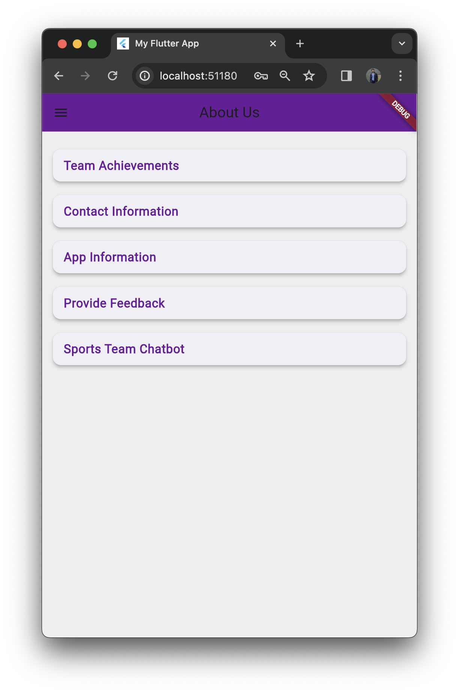

# SportsTeamManagementSystem
The SportsTeam Manager project is a Flutter-based app aimed at modernizing sports team management. Integrated with Firebase for real-time updates and Google Sign-In API for security, it goes beyond traditional management systems, fostering community engagement and event planning among college students.
# 🏀 SportsTeam Manager  

Flutter representation of a Sports Team Management app UI.

Star⭐ the repo if you like what you see 😉.

**Vishesh Sanghvi** 

## 📸 Screenshots

| About Us | Team |
|------|-------|
|||

| Events | Dashboard |
|------|-------|
||||

| Login1 | Welcome |
|------|-------|
|
|
|

## ✨ Requirements

- Any IDE with Flutter SDK installed (i.e., IntelliJ, Android Studio, VSCode, etc.)
- A little knowledge of Dart and Flutter
- A brain to think 🤓🤓

## Getting Started

This project is a starting point for a Flutter application.

A few resources to get you started if this is your first Flutter project:

Feel free to use, modify, and distribute this project! If you have any questions or suggestions, feel free to reach out. Happy coding! 🚀

